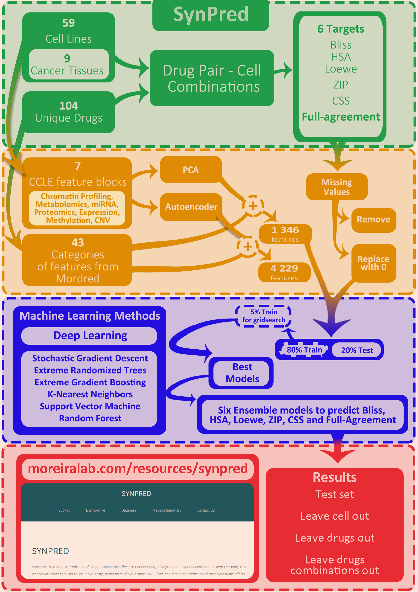

# SynPred
*Full Machine Learning Pipeline for the Synpred prediction and Stand-alone deployment*

<b>Background</b>: In cancer research, high-throughput screening technologies produce large amounts of multiomics data from different populations and cell types. However, analysis of such data encounters difficulties due to disease heterogeneity, further exacerbated by human biological complexity and genomic variability. The specific profile of cancer as a disease (or, more realistically, a set of diseases) urges the development of approaches that maximize the effect while minimizing the dosage of drugs. Now is the time to redefine the approach to drug discovery, bringing an Artificial Intelligence-powered informational view that integrates the relevant scientific fields and explores new territories.

<b>Results</b>: Here, we show SYNPRED, an interdisciplinary approach that leverages specifically designed ensembles of AI algorithms, links omics and biophysical traits to predict anticancer drug synergy. It uses five reference models (Bliss, Highest Single Agent, Loewe, Zero Interaction Potency and Combination Sensitivity Score), which, coupled with AI algorithms, allowed us to attain the ones with the best predictive performance and pinpoint the most appropriate reference model for synergy prediction, often overlooked in similar studies. By using an independent test set, SYNPRED exhibits state-of-the-art performance metrics either in the classification (accuracy – 0.85, precision – 0.91, recall – 0.90, AUROC – 0.80, and F1-score - 0.91) or in the regression models, mainly when using the Combination Sensitivity Score synergy reference model (RMSE – 11.07, MSE – 122.61, Pearson – 0.86, MAE – 7.43, Spearman – 0.87). Moreover, data interpretability was achieved by deploying the most current and robust feature importance approaches. A simple web-based application was constructed, allowing easy access by non-expert researchers.

<b>Conclusions</b> : The performance of SYNPRED rivals that of the existing methods that tackle the same problem, yielding unbiased results trained with one of the most comprehensive datasets available (NCI-ALMANAC). The leveraging of different reference models allowed deeper insights into which of them can be more appropriately used for synergy prediction. The Combination Sensitivity Score clearly stood out with improved performance among the full scope of surveyed approaches and synergy reference models. Furthermore, SYNPRED takes a particular focus on data interpretability, which has been in the spotlight lately when using the most advanced AI techniques. 

**Prerequisites**

To properly run SynPred the user should setup an isolated Conda environment. Please follow the specifications below.
1. `conda create --name synpred_env python=3.8.2` - There is no problem in changing the environment name, provided the user utilizes the same name onward. However, the user should use this Python version, as some packages (e.g. Tensorflow) do not have installation support with pip when this pipeline was constructed. 
2. `conda activate synpred_env` - All the following steps should be performed in the established environment. 

Then, the user needs to install several packages, for which will require *administrative* permissions:

3. `conda install -c conda-forge rdkit` - Install rdkit for molecular feature extraction with mordred.
4. `pip install pandas numpy rdkit-pypi` - Install useful packages.
5. `pip install mordred` - Install mordred for feature extraction.
6. `pip install pubchempy` - Install pubchempy to download SMILE from name.
7. `pip install tensorflow==2.3.1` - Install this version of tensorflow.
8. `pip install scikit-learn` - Scikit-learn is required at many steps of the pipeline. 
9. `pip install xgboost`- The package to use the Extreme Gradient Boosting methods needs to be installed separately from scikit-learn.
10. `pip install h5py`- Allows storage in h5 format.

**Stand-alone Deployment**

For the stand-alone development, the user will require the files in the folder `CCLE_processed`, which contains the CCLE features as processed in the paper. Furthermore, the user requires the pretrained models. These are too large for GitHub, as such, the user must download them at `http://www.moreiralab.com/resources/synpred`, at the `Stand-alone deployment section` and store them in a folder in the same location as the scripts, with the name `standalone_models`. Finally, the user must have performed environment setup and needs to run the standalone inside the activated environment.
Regarding the scripts, the only change required should be in the `standalone_variables.py` script, in which the user should change the `HOME` variable into the folder path on his/her computer.

Finally, the user must create (if not already cloned) a folder with the name `standalone_results` at the same folder of the scripts. 

The way to run the SynPred stand-alone deployment is, after initializing the conda environment typing:

`python standalone_synpred.py your_table_name.csv`

The user can then check the features and results calculated at the `standalone_results` folder. The user was to be careful and avoid overwriting of the predictions when running the script with different input tables. To check an example of the input file, consult the `standalone_example.csv`, in the folder of the scripts. The names of the columns should be the same, as well as the content. 

**Changes for pipeline replication**

After downloading/cloning this repository, there are still some changes to be made if you wish to replicate the full pipeline of SynPred.
1. At `synpred_variables.py`, change the variable `DEFAULT_LOCATION` to the location where you will be running your files
2. If the folders were not automatically downloaded, the user needs to create the folders, on the same location as the scripts, with the following names:
	- CCLE
	- datasets
	- evaluation_summary
	- redeployment_variables
	- resources
	- saved_model
	- support
	- train_log
	- split_tables
	- saved_model
3. Some of the files required are not available on this page as either they are too large or were developed by a third party. Particularly, the CCLE subsets, can be downloaded at CCLE website, and should go on the CCLE folder. There are 7 files required, please check file `support/CCLE_log_file.csv` to see which files are required for the full SynPred deployment. These files should have the same names as indicated in column `File_name` of the log file and go into `CCLE` folder. Furthermore, the user is also required to have the `DRUGCOMB` dataset at the location and name `datasets/drug_comb.csv`. Finally, the user should change the `datasets/example.csv` file to the file with the combinations, with the same format and columns as advised.

**Deploy the SynPred pipeline**

After performing the changes previously pointed and properly installing and setting up the environment, these scripts should simply run without requiring changes.
1. `synpred_variables.py` - Most of the variables are stored in here (paths, table variables, etc).
2. `synpred_support_functions.py` - Several functions that will be present in more than one script.
3. `synpred_process_drugcomb.py` - Process the input *DrugComb* dataset for the upcoming steps.
4. `synpred_merge_drug_features.py` - Join the drug features to the dataset.
5. `synpred_CCLE_filter.py` - Run this to generate CCLE subsets. Excludes only the features with 0 variance.
6. `synpred_edit_dataset.py` - Start by editing the dataset to generate the full-agreement class and generate the several different splits.
	Input and output files at the "datasets" folder.
7. `synpred_generate_final_datasets.py` - Run this script to generate dimensionality reduction (PCA) on the CCLE subsets. This also generates the dataset split combinations with the different pre-processings (missing values: drop or replace with 0; dimensionality reduction: PCA or autoencoder).
8. `synpred_keras.py`- Neural network to be run with keras/tensorflow. To be called from the command line or script 9.
9. `synpred_gridsearch_keras.py` - Run the gridsearch on the `synpred_keras.py`. Outputs to "evaluation_summary" folder. This makes use of only 10% of the train dataset.
10. `synpred_ML_gridsearch.py` - Run the gridsearch for the ML methods that do not involve Keras on 50% of the training set.
11. `synpred_process_gridsearch.py` - Process the gridsearch results to yield the best parameters.
12. `synpred_keras_final.py` - Neural network with keras/tensorflow after gridsearch. To be called from the command line or script 14.
13. `synpred_best_keras_final.py` - Run and save the best keras models.
14. `synpred_ML.py` - Run the best ML methods that do not involve Keras on the full training set, with the best parameters from script 11. Save the best models. 
15. `synpred_ensemble_gridsearch.py` - Test several ensemble methods, namely, several Keras neural network.
16. `synpred_ensemble_final.py` - Run the best ensemble model with Keras.

**Please cite:**

António J. Preto, Pedro Matos-Filipe, Joana Mourão and Irina S. Moreira

*SYNPRED: Prediction of Drug Combination Effects in Cancer using Different Synergy Metrics and Ensemble Learning*

